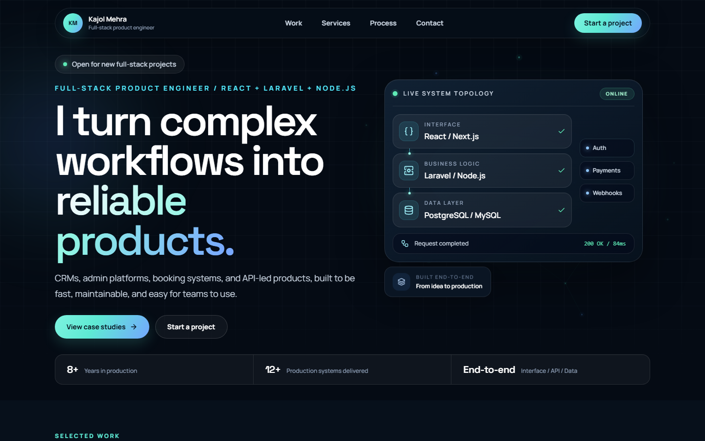
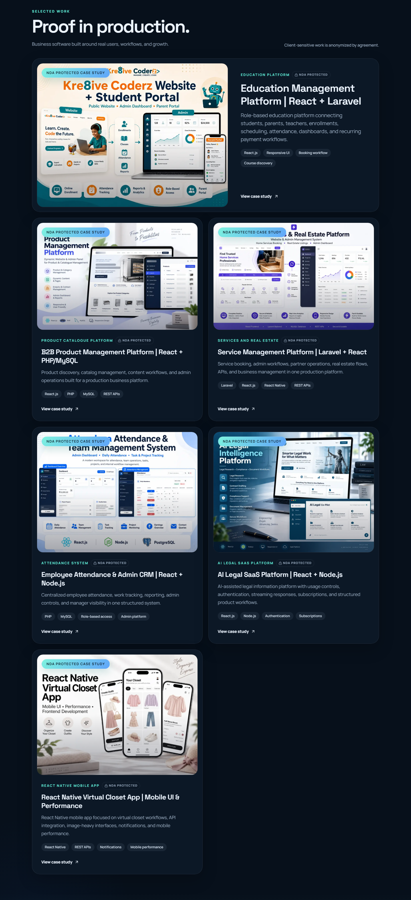
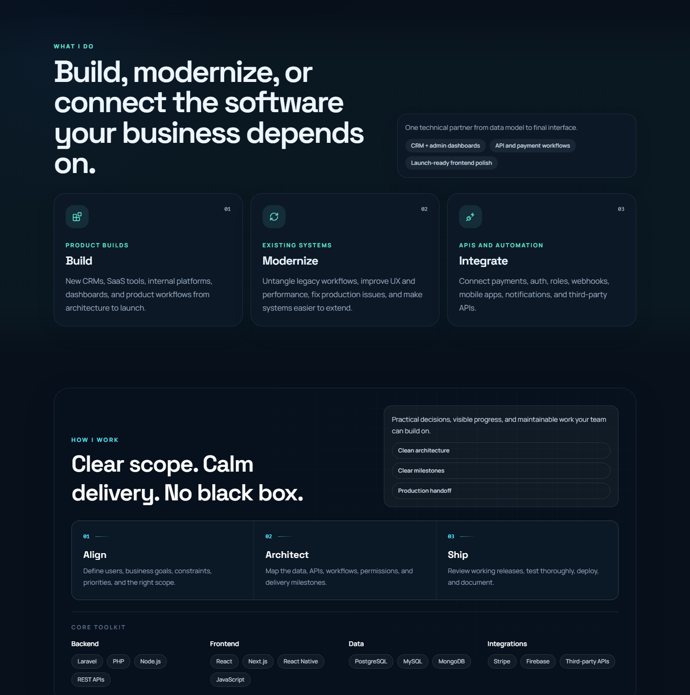
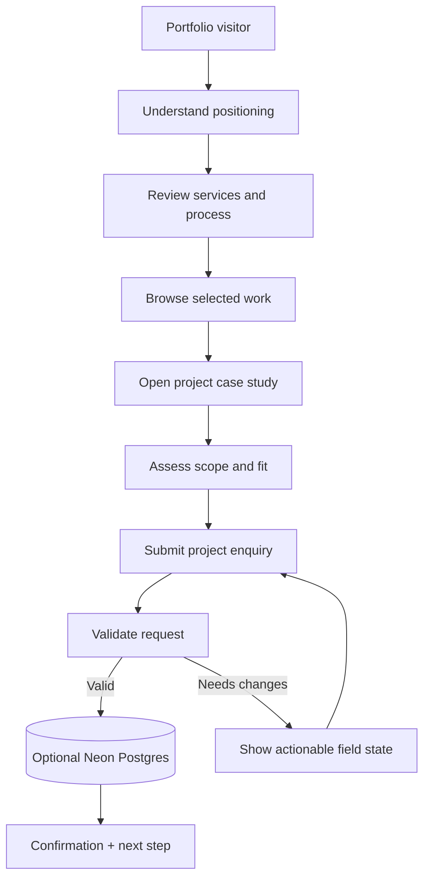

# Northstar Developer Portfolio

> A polished personal portfolio for a full-stack product engineer—built to communicate capability, show proof, and convert the right enquiries.

[View the live portfolio →](https://kajolmehra.vercel.app/work-with-me)

## Overview

This is a personal portfolio experience designed to make senior full-stack delivery easy to understand. It presents selected product work, explains build/modernize/integrate services, shows a calm delivery process, and turns qualified visitors into project enquiries. The implementation uses the Next.js App Router with reusable sections, project detail routes, theme switching, SEO metadata, and an API-backed contact form.

## Why this portfolio works

| Portfolio goal | Product decision |
| --- | --- |
| Establish credibility quickly | Clear positioning, production metrics, technical system visual, and a focused hero message |
| Show proof instead of promises | Selected-work cards with outcomes, stack labels, and dedicated case-study routes |
| Make services understandable | Build, modernize, and integrate paths mapped to common client needs |
| Reduce enquiry friction | Short contact flow with validation, confirmation feedback, and optional persistence |

## Visual tour

The public portfolio can include approved screenshots because it is your own product. These captures are cropped directly from the live portfolio so the case study shows the real product experience rather than a fabricated mockup.

### Homepage positioning

### Selected work

View services and process capture

A contact screenshot is intentionally excluded from this public gallery so no direct contact detail is published.

See the [screenshot guide](docs/SCREENSHOT-GUIDE.md) for capture rules and filenames.

## My contribution

- Information architecture for positioning, services, process, work, and contact conversion
- Reusable React sections and accessible UI primitives
- Dynamic project detail pages with image galleries and technology summaries
- Production-style proof blocks for years, systems delivered, and end-to-end ownership
- Dark/light theme support and responsive layouts
- Contact API with optional Neon Postgres persistence
- SEO metadata, canonical URLs, sitemap-ready configuration, and deployment setup

## Skills demonstrated

| Area | Applied |
| --- | --- |
| Next.js | App Router pages, layouts, metadata, route handlers, and production deployment conventions |
| React / TypeScript | Typed content models, reusable sections, composable UI, and predictable component contracts |
| Tailwind CSS | Responsive design system, theme tokens, spacing rhythm, and polished interaction states |
| Data | Neon serverless Postgres integration for contact submissions with environment-based configuration |
| UX / conversion | Case-study storytelling, service positioning, project filtering, proof blocks, and conversion-focused contact flow |
| Quality | Production build scripts, type checking, responsive behavior, and privacy-safe content management |

## Portfolio conversion flow

Northstar treats the portfolio as a product funnel: establish fit quickly, let proof do the selling, then turn a qualified visitor into a structured enquiry.

**Outcome:** visitors move from credibility to a clear, low-friction conversation without a generic contact page detour.

## Technical stack

Next.js 15 · React 19 · TypeScript · Tailwind CSS 4 · App Router · Lucide icons · Neon Postgres · Vercel-ready deployment.

## Portfolio delivery standard

- Senior-level presentation: outcome-led copy, restrained visual system, and purposeful motion rather than template sections.
- Case-study ready: each project can lead with a strong visual, a concise role summary, an architecture story, and a clear next step.
- Production-minded: responsive layouts, metadata, typed content, validated enquiries, environment-based configuration, and privacy-aware publishing.

## Privacy note

This repository is a public presentation of a personal portfolio product. Approved portfolio screenshots and branding may be shown; contact submissions, database records, environment values, deployment credentials, and private analytics must remain excluded. See [architecture](docs/ARCHITECTURE.md), [user flow](docs/USER-FLOWS.md), [security policy](SECURITY.md), and [screenshot guide](docs/SCREENSHOT-GUIDE.md).
"# northstar-developer-portfolio" 
