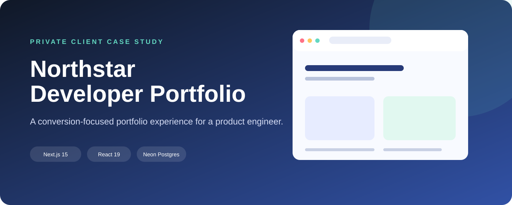
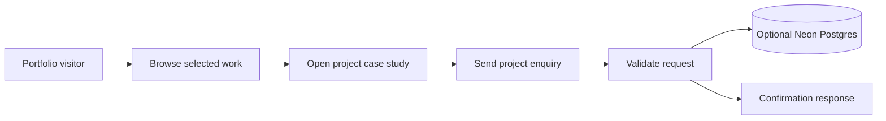

# Northstar Developer Portfolio

> A polished personal-brand and lead-capture experience for a full-stack product engineer.

## Overview

A responsive developer portfolio designed to present complex product work clearly, explain services, showcase selected case studies, and capture inbound project enquiries. The implementation uses the Next.js App Router with reusable sections, project detail routes, theme switching, SEO metadata, and an API-backed contact form.

## My contribution

- Information architecture for services, process, work, and contact conversion
- Reusable React sections and accessible UI primitives
- Dynamic project detail pages with image galleries and technology summaries
- Dark/light theme support and responsive layouts
- Contact API with optional Neon Postgres persistence
- SEO metadata, canonical URLs, sitemap-ready configuration, and deployment setup

## Skills demonstrated

| Area | Applied |
| --- | --- |
| Next.js | App Router pages, layouts, metadata, route handlers, and production deployment conventions |
| React / TypeScript | Typed content models, reusable sections, composable UI, and predictable component contracts |
| Tailwind CSS | Responsive design system, theme tokens, spacing rhythm, and polished interaction states |
| Data | Neon serverless Postgres integration for contact submissions with environment-based configuration |
| UX | Case-study storytelling, service positioning, project filtering, conversion-focused contact flow |
| Quality | Production build scripts, type checking, responsive behavior, and privacy-safe content management |

## Representative flow

## Technical stack

Next.js 15 · React 19 · TypeScript · Tailwind CSS 4 · App Router · Lucide icons · Neon Postgres · Vercel-ready deployment.

## Privacy note

This is a portfolio presentation, not a copy of the private website. Names, URLs, contact details, project content, and media are anonymized. See [architecture](docs/ARCHITECTURE.md), [user flow](docs/USER-FLOWS.md), [security policy](SECURITY.md), and [screenshot guide](docs/SCREENSHOT-GUIDE.md).
"# northstar-developer-portfolio" 
