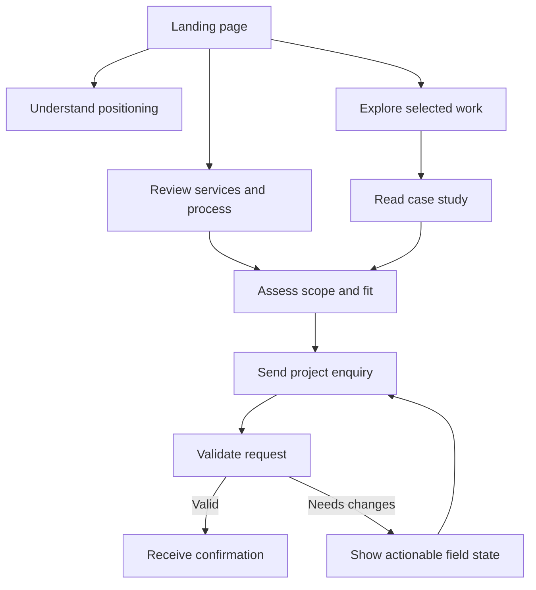

# User flows

```mermaid
flowchart TB
    Landing[Landing page] --> Position[Understand positioning]
    Landing --> Services[Review services and process]
    Landing --> Work[Explore selected work]
    Work --> CaseStudy[Read case study]
    Services --> Fit[Assess scope and fit]
    CaseStudy --> Fit
    Fit --> Enquiry[Send project enquiry]
    Enquiry --> Validate[Validate request]
    Validate -->|Valid| Confirmation[Receive confirmation]
    Validate -->|Needs changes| FormState[Show actionable field state]
    FormState --> Enquiry
```
